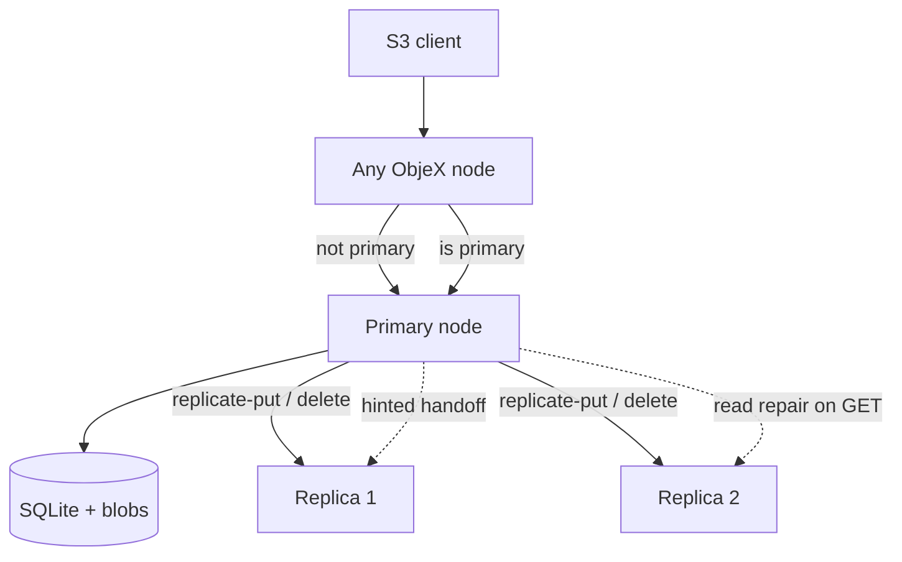

# ObjeX

<p align="center">
  <strong>Self-hosted object storage with an AWS S3-compatible HTTP API.</strong><br>
  Single static binary. Optional multi-node cluster with quorum replication.
</p>

<p align="center">
  <a href="https://github.com/VishalPainjane/ObjeX/actions/workflows/ci.yml"></a>
  <a href="LICENSE"></a>
  
</p>

<p align="center">
  <a href="#quick-start">Quick Start</a> &middot;
  <a href="#architecture">Architecture</a> &middot;
  <a href="#s3-api">S3 API</a> &middot;
  <a href="#cluster-mode">Cluster</a> &middot;
  <a href="#configuration">Configuration</a> &middot;
  <a href="docs/architecture/">Documentation</a> &middot;
  <a href="docs/showcase/case-study.md">Case Study</a>
</p>

---

## Overview

ObjeX stores opaque blobs behind a familiar S3 surface area. Clients use the same SDKs, signing rules, and HTTP verbs they already use against AWS — pointed at your endpoint instead of `s3.amazonaws.com`.

The implementation is deliberately split:

| Concern | Implementation |
|---------|----------------|
| **Metadata** | SQLite (buckets, objects, multipart state, credentials, replication hints) |
| **Payloads** | Content-addressed files on disk (`SHA-256(bucket/key)` paths) |
| **Distribution** | Static membership, rendezvous placement, primary forwarding, quorum coordinator |

That separation keeps the hot path simple in single-node mode and makes cluster behavior explicit: the replication layer coordinates copies without changing the client contract.

**Use ObjeX when you want:**

- A local or air-gapped S3 endpoint for development, CI fixtures, or edge caching
- A readable Go codebase that walks through placement, quorum, hints, and repair — not a black box
- Docker Compose profiles from one node to three, with Prometheus metrics and health probes built in

**Not a replacement for** multi-petabyte erasure-coded fleets. ObjeX targets correctness and clarity at modest scale. See [Roadmap](ROADMAP.md) for what is in scope.

---

## Architecture

### Request path (single node)

```text
  S3 client (aws-cli, SDK, presigned URL)
              |
              v
        +-------------+
        |  SigV4 auth |  except /health*, /metrics, /cluster
        +------+------+
               |
               v
        +-------------+
        |  HTTP API   |  routing, XML, batch delete, multipart
        +------+------+
               |
        +------+------+
        |             |
        v             v
   +---------+   +-----------+
   | SQLite  |   | Filesystem |  tmp -> rename, MD5 ETag
   | metadata|   | blob store |
   +---------+   +-----------+
```

### Request path (cluster mode)

Any node accepts the client request. Non-primary nodes forward object operations to the placement primary. The primary coordinates quorum writes, replica fan-out, and durable hints for lagging peers.



### Package map

| Package | Role |
|---------|------|
| `internal/api` | S3 HTTP surface, cluster forwarding, presign helper |
| `internal/auth` | AWS Signature V4, presigned URLs, inter-node token |
| `internal/object` | PUT/GET/HEAD/DELETE, multipart, copy, ETags |
| `internal/metadata/sqlite` | Buckets, objects, credentials, hints |
| `internal/storage/filesystem` | Content-addressed blobs, atomic writes |
| `internal/cluster` | Membership, rendezvous placement, proxy, peer health |
| `internal/replication` | Quorum coordinator, replicator, hints worker, healing |
| `internal/jobs` | Orphan cleanup, multipart expiry, integrity verification |
| `internal/metrics` | Prometheus counters and histograms |

Physical layout for an object:

```text
{OBJEX_DATA_DIR}/blobs/{bucket}/{L1}/{L2}/{sha256}.blob
```

where `sha256 = SHA256("{bucket}/{key}")`. Writes land as `.tmp` files and are renamed into place.

---

## S3 API

Base URL: `http://<host>:9000` (default). All object routes require **AWS Signature Version 4** unless noted.

### Buckets

| Method | Path | Action |
|--------|------|--------|
| `GET` | `/` | List buckets |
| `PUT` | `/{bucket}` | Create bucket |
| `DELETE` | `/{bucket}` | Delete bucket |
| `HEAD` | `/{bucket}` | Head bucket |
| `GET` | `/{bucket}?list-type=2` | List objects (v2) |

### Objects

| Method | Path | Action |
|--------|------|--------|
| `PUT` | `/{bucket}/{key}` | Put object |
| `GET` | `/{bucket}/{key}` | Get object (supports `Range`) |
| `HEAD` | `/{bucket}/{key}` | Head object |
| `DELETE` | `/{bucket}/{key}` | Delete object |
| `POST` | `/{bucket}?delete` | Batch delete (XML body) |
| `PUT` | `/{bucket}/{key}` + `x-amz-copy-source` | Copy object |

### Multipart

| Query | Action |
|-------|--------|
| `?uploads` | Initiate multipart upload |
| `?uploadId=…&partNumber=n` | Upload part |
| `?uploadId=…` (POST) | Complete upload |
| `?uploadId=…` (DELETE) | Abort upload |
| `?uploads` (GET) | List in-progress uploads |

### Utilities

| Method | Path | Auth | Purpose |
|--------|------|------|---------|
| `GET` | `/api/presign/{bucket}/{key}` | SigV4 | Presigned GET/PUT URL helper |
| `GET` | `/health/live` | none | Liveness |
| `GET` | `/health/ready` | none | Readiness (storage + metadata) |
| `GET` | `/metrics` | none | Prometheus scrape target |
| `GET` | `/cluster` | none | Cluster membership and peer status |

---

## Cluster mode

Static membership is loaded from `OBJEX_CLUSTER_CONFIG` (JSON). Every node runs the same list so placement is deterministic.

**Placement** — Rendezvous hashing selects a primary and `N - 1` replicas for each `(bucket, key)`. No randomness, no map iteration order.

**Quorum** — Configurable `N` (replication factor), `W` (write quorum), `R` (read quorum). Default on a 3-node profile: `N=3`, `W=2`, `R=2`.

**Failure handling** — Durable replication hints for offline replicas. Read repair on GET when versions diverge. Background healing for partial replicas. Peer health probes with recovery callbacks.

**Inter-node auth** — `X-ObjeX-Internal-Token` when `OBJEX_CLUSTER_INTERNAL_TOKEN` is set. Internal replicate operations are distinct from client-facing S3 requests (no replication loops).

```bash
docker compose -f docker-compose.cluster.yml up -d --build

# Node endpoints
#   http://localhost:9001
#   http://localhost:9002
#   http://localhost:9003

curl -s http://localhost:9001/cluster | jq .
```

Full design notes: [docs/architecture/distributed-architecture.md](docs/architecture/distributed-architecture.md), [docs/architecture/quorum.md](docs/architecture/quorum.md).

---

## Quick start

### Docker (recommended)

```bash
git clone https://github.com/VishalPainjane/ObjeX.git
cd ObjeX
docker compose up -d --build
```

The API listens on **port 9000**. Default development credentials (change before any real deployment):

| Setting | Value |
|---------|-------|
| Endpoint | `http://localhost:9000` |
| Access key ID | `OBXTESTKEY00000001` |
| Secret access key | `testsecretkeythatislongenoughforhmacsha256test` |

### Verify with AWS CLI

```bash
export AWS_ACCESS_KEY_ID=OBXTESTKEY00000001
export AWS_SECRET_ACCESS_KEY=testsecretkeythatislongenoughforhmacsha256test

aws --endpoint-url http://localhost:9000 s3 mb s3://photos
echo "ObjeX works." > hello.txt
aws --endpoint-url http://localhost:9000 s3 cp hello.txt s3://photos/
aws --endpoint-url http://localhost:9000 s3 ls s3://photos/
curl -sf http://localhost:9000/health/ready
```

### Demo scripts

| Platform | Command |
|----------|---------|
| Linux / macOS | `./scripts/demo.sh` |
| Windows | `.\scripts\demo.ps1` |
| 3-node cluster | `./scripts/demo-cluster.sh` or `.\scripts\demo-cluster.ps1` |

### Run from source

```bash
go test ./...
go run ./cmd/objex
# S3 API     -> http://localhost:9000
# Health     -> http://localhost:9000/health/ready
# Metrics    -> http://localhost:9000/metrics
```

---

## Configuration

Common environment variables:

| Variable | Default | Description |
|----------|---------|-------------|
| `OBJEX_HTTP_ADDRESS` | `:9000` | HTTP listen address |
| `OBJEX_DATA_DIR` | `./data` | SQLite database and blob root |
| `OBJEX_PUBLIC_URL` | derived from request | Base URL for presigned links |
| `OBJEX_ACCESS_KEY_ID` | — | S3 access key (required for SigV4) |
| `OBJEX_SECRET_ACCESS_KEY` | — | S3 secret key |
| `OBJEX_MAX_UPLOAD_BYTES` | `0` (unlimited) | Per-request upload cap |
| `OBJEX_CLUSTER_CONFIG` | — | Path to cluster membership JSON |
| `OBJEX_NODE_ID` | `node-1` | This node's identity in the cluster |
| `OBJEX_REPLICATION_FACTOR` | `1` | `N` — nodes in the replica set |
| `OBJEX_WRITE_QUORUM` | `1` | `W` — writes need W acknowledgements |
| `OBJEX_READ_QUORUM` | `1` | `R` — reads consult R replicas |
| `OBJEX_CLUSTER_INTERNAL_TOKEN` | — | Shared secret for inter-node requests |

Sample cluster configs: [`configs/cluster-3.json`](configs/cluster-3.json), [`configs/cluster-3-docker.json`](configs/cluster-3-docker.json).

---

## Observability

| Endpoint | Format | Notes |
|----------|--------|-------|
| `/metrics` | Prometheus text | Request, storage, replication, cluster-forward counters |
| `/health/live` | JSON | Process is running |
| `/health/ready` | JSON | Metadata store and blob directory are writable |
| `/cluster` | JSON | Node list, placement config, peer reachability |

Background jobs (started from `cmd/objex`):

- Orphan blob cleanup — metadata says deleted, file still on disk
- Abandoned multipart cleanup — expired upload sessions
- Integrity verification — re-hash stored bytes against recorded ETag

---

## Project layout

```text
cmd/objex/              Main server binary
internal/
  api/                  S3 HTTP handler and integration tests
  auth/                 SigV4, presign, internal cluster token
  cluster/              Placement, proxy forwarding, peer health
  config/               Environment and cluster JSON loading
  jobs/                 Background maintenance and integrity checks
  metadata/sqlite/      Buckets, objects, multipart, hints, credentials
  object/               Domain service (put/get/delete, multipart, copy)
  quorum/               N/R/W quorum math
  replication/          Coordinator, replicator, hints, healing
  s3/                   XML responses and batch-delete parsing
  storage/filesystem/   Content-addressable blob store
  validation/           Bucket and key validators
configs/                Sample cluster membership files
docs/
  architecture/         Design deep-dives (quorum, replication, placement, …)
  showcase/             Portfolio case study and landing page
docker-compose.yml      Single-node profile
docker-compose.cluster.yml   Three-node profile
```

---

## Documentation

| Document | Contents |
|----------|----------|
| [Architecture overview](docs/architecture/architecture.md) | Component diagram and request flow |
| [Distributed architecture](docs/architecture/distributed-architecture.md) | Cluster topology, forwarding, internal protocol |
| [Quorum](docs/architecture/quorum.md) | N/R/W semantics, version handling, tombstones |
| [Replication](docs/architecture/replication.md) | Coordinator, streaming, stale-write rejection |
| [Placement](docs/architecture/placement.md) | Rendezvous hashing, replica selection |
| [Storage](docs/architecture/storage.md) | Blob layout, atomic writes, disk guards |
| [Authentication](docs/architecture/authentication.md) | SigV4, presign, internal token |
| [Case study](docs/showcase/case-study.md) | Interview talking points and demo script |
| [Roadmap](ROADMAP.md) | Shipped features and planned work |

Portfolio site (enable **GitHub Pages → Source: GitHub Actions**): [vishalpainjane.github.io/ObjeX](https://vishalpainjane.github.io/ObjeX/)

---

## Development

```bash
go test ./...          # unit and integration tests
go test -race ./...    # race detector (Linux CI runs this on every push)
go vet ./...
go build ./...
```

CI workflow: [`.github/workflows/ci.yml`](.github/workflows/ci.yml) — test, vet, build, race on `main` and pull requests.

Contributing: [CONTRIBUTING.md](CONTRIBUTING.md)

---

## Roadmap snapshot

**Shipped** — S3 object API, multipart, SigV4, presigned URLs, SQLite + filesystem storage, cluster placement, quorum replication, hinted handoff, read repair, peer health, healing, Docker Compose, Prometheus metrics, integrity verification job.

**Next** — Presigned POST, `aws-chunked` uploads, PostgreSQL metadata backend, Helm chart.

**Deferred** — Erasure coding, automatic rebalancing, web UI, full S3 ACL model.

Details: [docs/architecture/roadmap.md](docs/architecture/roadmap.md)

---

## License

MIT — see [LICENSE](LICENSE).

---

## Author

**Vishal Painjane**

- GitHub: [@VishalPainjane](https://github.com/VishalPainjane)
- Email: painjanevishal2204@gmail.com
